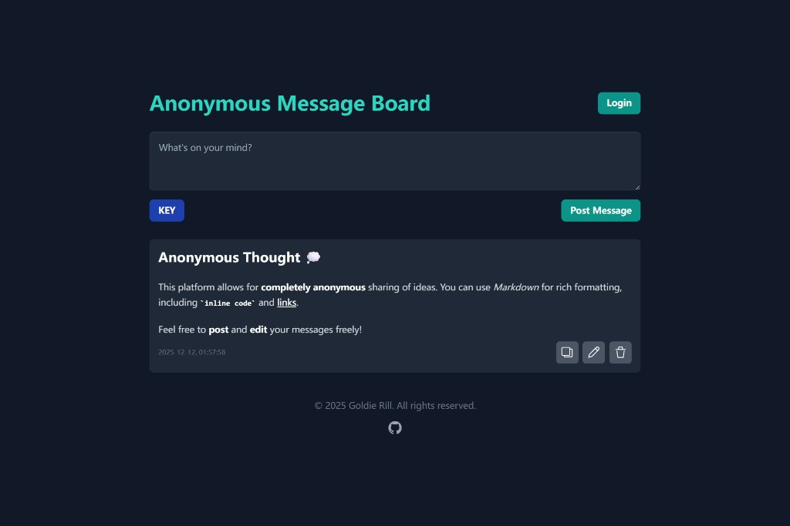

# Anonymous Message Board

A simple, anonymous message board web application built with Node.js, Express, EJS, and SQLite3, containerized using Docker and Docker Compose. This application features a pure dark mode interface, support for Markdown content, and allows users to post, edit, and delete messages anonymously.



## Features

*   **Anonymous Posting**: Share your thoughts without revealing your identity.
*   **Pure Dark Mode**: A sleek, modern dark theme is enforced throughout the application. No theme switching needed.
*   **SQLite3 Database**: Lightweight and efficient data storage.
*   **Data Persistence**: All messages are stored persistently using Docker volumes, ensuring your data is safe across container restarts.
*   **Markdown Support**: Write messages using Markdown syntax (headings, bold, italics, lists, code blocks, etc.), which will be rendered beautifully.
*   **Edit & Delete Messages**: Users can edit their previously posted messages or delete them.
*   **Private Messages with KEY Protection**: Post private messages protected by a KEY. Only users who know the correct KEY can view these messages.
*   **User Authentication**: Register and login system with session-based authentication.
*   **User-Specific Private Messages**: Logged-in users can view all their private messages without entering KEYs individually.
*   **File Upload Support**: Upload and display files in messages (one file per message, max 50MB, supports all file types). Images show previews, other files show download links.
*   **Pagination with Google-Style Navigation**: Messages are displayed with Google search results-style pagination (e.g., < 1 2 3 4 5 ... 100 >). Each page shows 5 messages with previous/next buttons and direct page navigation.
*   **Database Performance Optimization**: Built-in indexes for faster queries, better scalability for research and learning.
*   **Responsive Design**: The application is designed to be accessible and usable across various devices, with mobile-friendly buttons.
*   **Dockerized Deployment**: Easy setup and deployment using Docker and Docker Compose.

## Tech Stack

*   **Backend**: Node.js (Latest Alpine) with Express.js
*   **Database**: SQLite3 with performance indexes for optimized queries
*   **Authentication**: Express Session with SQLite session store, bcrypt for password hashing
*   **Templating**: EJS
*   **Styling**: Tailwind CSS (configured for `darkMode: 'class'`)
*   **Client-side Logic**: Native JavaScript (Fetch API)
*   **Markdown Rendering**: Showdown.js
*   **File Upload**: Multer for handling file uploads (all types, up to 50MB)
*   **Containerization**: Docker, Docker Compose

## Getting Started

These instructions will get you a copy of the project up and running on your local machine.

### Prerequisites

You need to have Docker and Docker Compose installed on your system.

*   [Install Docker](https://docs.docker.com/get-docker/)

### Important Note for Cross-Platform Compatibility

sqlite3 is a native Node.js module that needs to be compiled on specific platform architectures. Binaries compiled on Windows are not compatible with Linux Docker containers.

To rebuild the container: Reinstall and recompile all dependencies inside the container
```bash
docker compose up --build -d
```

### Installation

1.  **Clone the repository:**
    ```bash
    git clone https://github.com/carterwayneskhizeine/AnonymousMessageBoard.git
    cd AnonymousMessageBoard
    ```

2.  **Build and run the application using Docker Compose:**
    ```bash
    docker compose up --build -d
    ```
    This command will:
    *   Build the Docker image for the `message-board` service based on the `Dockerfile`.
    *   Install all Node.js dependencies, including Tailwind CSS and Showdown.js.
    *   Run the Tailwind CSS build process.
    *   Start the `message-board` container in detached mode (`-d`).
    *   Map port `1989` from your host to the container.
    *   Mount a local `./data` directory to `/app/data` inside the container for SQLite database persistence.

### Accessing the Application

Once the Docker containers are up and running, open your web browser and navigate to:

[http://localhost:1989](http://localhost:1989)

## Usage

### Public Messages
*   **Post a Message**: Type your message (you can use Markdown!) in the text area and click "Post Message".
*   **Edit a Message**: Click the "Edit" button next to a message. An edit box will appear pre-filled with the message's original Markdown content. Make your changes and click "Save".
*   **Delete a Message**: Click the "Delete" button next to a message. Confirm your action to remove the message.

### Private Messages
*   **Post a Private Message**:
    1. Type your message in the text area
    2. Click "Post Message"
    3. In the popup dialog, select "Private Message"
    4. Enter a KEY (any text or symbols) for your private message
    5. Click "Confirm" to send
    *Note: Private messages are not immediately visible after posting*

*   **View Private Messages**:
    1. Click the "KEY" button below the message input area
    2. A KEY input field will appear between the KEY button and Post Message button
    3. Enter the correct KEY for the private messages you want to view
    4. Click the "Send" button or press Enter
    5. Matching private messages will appear above all public messages, marked with private

*   **Hide Private Messages**:
    *   Click the "KEY" button again to hide the input field and clear the KEY
    *   Refresh the page - private messages are automatically hidden on page refresh
    *   Private messages require re-entering the KEY to view again

### User Authentication

#### Registration and Login
*   **Register a New Account**:
    1. Click the "Login" button in the top-right corner of the page
    2. In the login modal, click the "Register" button in the bottom-left corner
    3. Fill in the registration form:
        - Username (3-20 characters)
        - Password (at least 6 characters)
        - Confirm password
    4. Click "Register" to create your account
    *Note: After successful registration, you will be automatically logged in*

*   **Login to Existing Account**:
    1. Click the "Login" button in the top-right corner
    2. Enter your username and password
    3. Click "Login"
    *Note: Login status is maintained via session cookies*

*   **Logout**:
    - Click the "登出" button in the top-right corner when logged in

### File Messages

*   **Post a Message with File**:
    1. Type your message in the text area (optional - you can post just a file)
    2. Click the "📎" (paperclip) button below the text area
    3. Select any file from your device (max 50MB, any file type)
    4. The file preview will appear below the upload button (image preview for images, file icon for other types)
    5. Click "Post Message" to send
    *Note: Each message can contain either text, a file, or both*

*   **View File Messages**:
    - For image files: displayed with preview above text content
    - For other files: displayed with file icon, name, type and download link above text content
    - Click on an image to view it in full size
    - File messages follow the same privacy rules as text messages

*   **Remove Selected File**:
    - Click the "Remove" button on the file preview to cancel file selection
    - This only removes the selection before posting, not already posted files

*   **Edit File Messages**:
    - Messages containing files cannot be edited (to maintain one-file-per-message constraint)
    - To modify a file message, delete it and create a new one

#### User-Specific Features
*   **Automatic Private Message Access**: Once logged in, all your private messages are automatically displayed without needing to enter KEYs.
*   **Dual-Mode Private Messages**:
    *   **Traditional Mode**: Create private messages with KEYs (works for both logged-in and anonymous users)
    *   **User Mode**: When logged in, private messages are automatically associated with your account and accessible without KEYs
*   **Backward Compatibility**:
    *   Existing private messages with KEYs continue to work as before
    *   Anonymous users can still create and view private messages using KEYs
    *   Logged-in users can access both types

### API Usage with curl

You can interact with the message board API directly using `curl` commands. This is useful for testing, automation, or integration with other tools.

#### Basic Message Operations

**1. Get all public messages**
```bash
curl -s "http://localhost:1989/api/messages"
```

**2. Post a public message**
```bash
curl -s -X POST "http://localhost:1989/api/messages" \
  -H "Content-Type: application/json" \
  -d "{\"content\": \"Your message here\"}"
```

**3. Post a private message with KEY**
```bash
curl -s -X POST "http://localhost:1989/api/messages" \
  -H "Content-Type: application/json" \
  -d "{\"content\": \"Secret message\", \"isPrivate\": true, \"privateKey\": \"your-secret-key\"}"
```

**4. View private messages with KEY**
```bash
curl -s "http://localhost:1989/api/messages?privateKey=your-secret-key"
```

**5. Get messages with pagination**
```bash
# Get page 1 (default, 5 messages per page)
curl -s "http://localhost:1989/api/messages?page=1&limit=5"

# Get page 2 with private key
curl -s "http://localhost:1989/api/messages?page=2&limit=5&privateKey=your-secret-key"

# Get page 3 as logged-in user (with session cookie)
curl -s "http://localhost:1989/api/messages?page=3&limit=5" -b cookies.txt
```

#### User Authentication API

**6. Register a new user**
```bash
curl -s -X POST "http://localhost:1989/api/auth/register" \
  -H "Content-Type: application/json" \
  -d "{\"username\": \"testuser\", \"password\": \"password123\"}"
```

**7. Login (creates a session cookie)**
```bash
curl -s -X POST "http://localhost:1989/api/auth/login" \
  -H "Content-Type: application/json" \
  -d "{\"username\": \"testuser\", \"password\": \"password123\"}" \
  -c cookies.txt
```

**8. Get current user info (with session cookie)**
```bash
curl -s "http://localhost:1989/api/auth/me" \
  -b cookies.txt
```

**9. Logout**
```bash
curl -s -X POST "http://localhost:1989/api/auth/logout" \
  -b cookies.txt
```

#### File Upload API

**10. Upload a file (any type)**
```bash
curl -s -X POST "http://localhost:1989/api/upload-file" \
  -F "file=@/path/to/your/file.pdf" \
  -H "Content-Type: multipart/form-data"
```

**11. Post a message with file (two-step process)**
```bash
# Step 1: Upload the file
curl -s -X POST "http://localhost:1989/api/upload-file" \
  -F "file=@/path/to/your/file.pdf" \
  -H "Content-Type: multipart/form-data" \
  -o upload-response.json

# Step 2: Post message with file reference
curl -s -X POST "http://localhost:1989/api/messages" \
  -H "Content-Type: application/json" \
  -d "$(cat <<'EOF'
{
  "content": "Message with file",
  "hasImage": true,
  "imageFilename": "$(jq -r '.filename' upload-response.json)",
  "imageMimeType": "$(jq -r '.mimeType' upload-response.json)",
  "imageSize": $(jq -r '.size' upload-response.json)
}
EOF
)"
```

**12. Post private message with file**
```bash
curl -s -X POST "http://localhost:1989/api/messages" \
  -H "Content-Type: application/json" \
  -d "{\"content\": \"Private file message\", \"isPrivate\": true, \"privateKey\": \"secret123\", \"hasImage\": true, \"imageFilename\": \"1734267890123_abc123_document.pdf\", \"imageMimeType\": \"application/pdf\", \"imageSize\": 512000}"
```

**13. Backward compatibility - Upload an image using the original endpoint**
```bash
curl -s -X POST "http://localhost:1989/api/upload" \
  -F "image=@/path/to/your/image.jpg" \
  -H "Content-Type: multipart/form-data"
```

#### Advanced Examples

**13. Post message as logged-in user (with session cookie)**
```bash
curl -s -X POST "http://localhost:1989/api/messages" \
  -H "Content-Type: application/json" \
  -d "{\"content\": \"Message from logged-in user\"}" \
  -b cookies.txt
```

**14. Post private message as logged-in user (auto-generates KEY)**
```bash
curl -s -X POST "http://localhost:1989/api/messages" \
  -H "Content-Type: application/json" \
  -d "{\"content\": \"Private message from user\", \"isPrivate\": true}" \
  -b cookies.txt
```

**15. Get messages for logged-in user (shows user's private messages)**
```bash
curl -s "http://localhost:1989/api/messages" \
  -b cookies.txt
```

#### Response Format Examples

**Successful message post response:**
```json
{
  "id": 5,
  "content": "Your message",
  "timestamp": "2025-12-12 14:04:51",
  "is_private": 0,
  "private_key": null,
  "user_id": null,
  "has_image": 0,
  "image_filename": null,
  "image_mime_type": null,
  "image_size": null
}
```

**Image message post response:**
```json
{
  "id": 6,
  "content": "Check out this image!",
  "timestamp": "2025-12-15 15:30:45",
  "is_private": 0,
  "private_key": null,
  "user_id": null,
  "has_image": 1,
  "image_filename": "1734267890123_abc123_image.jpg",
  "image_mime_type": "image/jpeg",
  "image_size": 102400
}
```

**Image upload response:**
```json
{
  "success": true,
  "filename": "1734267890123_abc123_image.jpg",
  "originalName": "myphoto.jpg",
  "mimeType": "image/jpeg",
  "size": 102400,
  "url": "/uploads/1734267890123_abc123_image.jpg"
}
```

**Messages list response (with pagination):**
```json
{
  "messages": [
    {
      "id": 1,
      "content": "Public message",
      "timestamp": "2025-12-12 14:03:29",
      "is_private": 0,
      "private_key": null,
      "user_id": null,
      "has_image": 0,
      "image_filename": null,
      "image_mime_type": null,
      "image_size": null
    },
    {
      "id": 2,
      "content": "Message with image",
      "timestamp": "2025-12-15 15:35:20",
      "is_private": 0,
      "private_key": null,
      "user_id": null,
      "has_image": 1,
      "image_filename": "1734267890123_abc123_image.jpg",
      "image_mime_type": "image/jpeg",
      "image_size": 102400
    }
  ],
  "pagination": {
    "page": 1,
    "limit": 5,
    "total": 42,
    "totalPages": 9,
    "hasNextPage": true,
    "hasPrevPage": false
  },
  "hasPrivateMessages": false,
  "privateKeyProvided": false,
  "userId": null
}
```

#### Tips
- Use `-s` flag for silent mode (no progress meter)
- Use `-v` flag for verbose output to see request/response headers
- Save cookies with `-c cookies.txt` and reuse with `-b cookies.txt`
- For Windows PowerShell, use double quotes and escape inner quotes with backtick (`)
- For Windows CMD, use double quotes and escape inner quotes with backslash (\\)

#### Examples in Other Languages
Examples using JavaScript (fetch/axios), Python (requests/aiohttp), and Node.js follow the same patterns as the curl examples above. Use `credentials: 'include'` or session handling for authentication.

### Markdown Examples

You can use standard Markdown syntax in your messages, for example:

```markdown
## Anonymous Thought 💭

This platform allows for completely **anonymous sharing** of ideas. You can use **Markdown** for rich formatting,
including `inline code` and [links](https://links).

Feel free to **post** and **edit** your messages freely!

```

## Project Structure

*   `./data/`: Contains the `messages.db` SQLite database file (persisted via Docker volume).
    *   `data/uploads/`: Directory for uploaded image files (created automatically).
*   `./public/`: Static assets (CSS, client-side JS).
    *   `public/js/main.js`: Main client-side script for dynamic interactions (modified to support private messages).
    *   `public/style.css`: Compiled Tailwind CSS output.
*   `./src/`: Server-side source code and input CSS.
    *   `src/index.js`: Express.js backend server (modified to support private messages API).
    *   `src/input.css`: Tailwind CSS input file.
*   `./views/`: EJS template files.
    *   `views/index.ejs`: Main application layout (modified to add KEY button, input field, and modal dialog).
*   `Dockerfile`: Defines the Docker image build process.
*   `docker-compose.yml`: Defines the services, networks, and volumes for Docker Compose.
*   `package.json`: Node.js project metadata and dependencies.
*   `tailwind.config.js`: Tailwind CSS configuration.
*   `.gitignore`: Specifies intentionally untracked files to ignore.

### Key Modifications for Features

#### Private Messages Feature
The following files were modified to implement the private messages feature:

1. **`src/index.js`**:
   - Added `is_private` and `private_key` columns to the `messages` table
   - Modified `POST /api/messages` to accept `isPrivate` and `privateKey` parameters
   - Modified `GET /api/messages` to support `privateKey` query parameter
   - Updated root route to only show public messages

2. **`views/index.ejs`**:
   - Added dark "KEY" button below message input
   - Added KEY input field and "Send" button (hidden by default)
   - Added modal dialog for message type selection (Public/Private)
   - Added error message display area

3. **`public/js/main.js`**:
   - Added event listeners for KEY button, Send button, and modal dialog
   - Modified message posting flow to show type selection dialog
   - Updated message loading to filter by private KEY
   - Added error handling for invalid KEY input

#### File Upload Feature
The following modifications were made to implement file upload functionality:

1. **`package.json`**:
   - Added new dependency: `multer` for handling file uploads

2. **`src/index.js`**:
   - Added `has_image`, `image_filename`, `image_mime_type`, `image_size` columns to the `messages` table
   - Added Multer configuration for file uploads (50MB limit, all file types)
   - Added `/api/upload` endpoint for backward compatibility (now supports all file types)
   - Added `/api/upload-file` endpoint for general file uploads
   - Added permission middleware for file access (follows same rules as messages)
   - Modified `POST /api/messages` to accept file parameters
   - Enhanced `DELETE /api/messages/:id` to delete associated files
   - Added orphaned file cleanup function (runs hourly)

3. **`views/index.ejs`**:
   - Added file upload button (paperclip icon) below message input area
   - Added hidden file input for file selection (accepts all file types)
   - Added file preview container with remove button (shows image preview or file icon)
   - Added file status display

4. **`public/js/main.js`**:
   - Added file upload state management (`selectedFile` variable)
   - Added `uploadFile()` function for uploading files to server
   - Added file selection and preview functionality (image preview for images, file icon for other types)
   - Modified `renderMessage()` to display files in messages (image preview or download link)
   - Added click-to-view functionality for images
   - Modified message posting to handle files (two-step process: upload then post)
   - Added restriction: messages with files cannot be edited

#### User Authentication Feature
The following modifications were made to implement user authentication:

1. **`package.json`**:
   - Added new dependencies: `bcrypt`, `express-session`, `connect-sqlite3`

2. **`src/index.js`**:
   - Added `users` table with `id`, `username`, `password_hash`, `created_at` columns
   - Added `user_id` column to `messages` table for message ownership
   - Added session middleware with SQLite session store
   - Added password utility functions (`hashPassword`, `comparePassword`)
   - Added authentication APIs:
     - `POST /api/auth/register` - User registration
     - `POST /api/auth/login` - User login
     - `POST /api/auth/logout` - User logout
     - `GET /api/auth/me` - Get current user info
   - Modified message APIs to support user authentication:
     - `GET /api/messages` - Returns public messages + user's private messages when logged in
     - `POST /api/messages` - Associates messages with user_id when logged in
     - `PUT /api/messages/:id` - Added permission check (users can only edit their own messages)
     - `DELETE /api/messages/:id` - Added permission check (users can only delete their own messages)
   - Added authentication middleware (`requireAuth`, `getCurrentUser`)

3. **`views/index.ejs`**:
   - Added user area in header with login button (top-right corner)
   - Added login modal with registration button in bottom-left corner
   - Added registration modal
   - Added conditional rendering based on user login status
   - Added user view with username display and logout button

4. **`public/js/main.js`**:
   - Added authentication-related DOM elements
   - Added authentication helper functions (`updateUIForUser`, `checkAuthStatus`, `showError`, `clearError`)
   - Modified `fetchAndRenderMessages` to handle user authentication
   - Added event handlers for login, registration, and logout
   - Modified message posting logic for logged-in users
   - Added registration flow from login modal

#### Pagination Feature
The following modifications were made to implement Google-style pagination:

1. **`src/index.js`**:
   - Modified `GET /api/messages` endpoint to support pagination parameters (`page`, `limit`)
   - Added pagination query logic with `LIMIT` and `OFFSET`
   - Added total message count query for calculating total pages
   - Enhanced response format to include pagination metadata:
     - `pagination.page`: Current page number
     - `pagination.limit`: Messages per page (default: 5)
     - `pagination.total`: Total messages matching criteria
     - `pagination.totalPages`: Total number of pages
     - `pagination.hasNextPage`: Whether there's a next page
     - `pagination.hasPrevPage`: Whether there's a previous page

2. **`public/js/main.js`**:
   - Added pagination state variables (`currentPage`, `totalPages`, `currentPrivateKey`)
   - Modified `fetchAndRenderMessages()` function to accept page parameter
   - Added `renderPagination()` function to generate Google-style pagination controls
   - Added `calculatePagesToShow()` function for intelligent page number display (e.g., < 1 2 3 4 5 ... 100 >)
   - Added URL state management functions (`updateURL()`, `parseURLParams()`)
   - Added support for URL parameters (`?page=2&key=secret`) to maintain state

3. **`views/index.ejs`**:
   - Added pagination container (`<div id="pagination-container"></div>`) after message list
   - Pagination controls are dynamically injected by JavaScript

#### Database Index Optimization Feature
The following modifications were made to optimize database query performance with indexes:

1. **`src/index.js`**:
   - Refactored database initialization logic into sequential functions:
     - `initializeDatabase()` - Creates messages table
     - `addMissingColumns()` - Adds missing columns to existing tables
     - `createUsersTable()` - Creates users table
     - `createDatabaseIndexes()` - Creates performance indexes
   - Added the following database indexes:
     - `idx_messages_timestamp` - Optimizes message listing by timestamp (DESC order)
     - `idx_messages_is_private` - Optimizes filtering public/private messages
     - `idx_messages_user_id` - Optimizes finding user's messages
     - `idx_messages_private_key` - Optimizes private message lookup by KEY
     - `idx_messages_has_image` - Optimizes filtering messages with images
     - `idx_users_username` - Optimizes user login by username
   - Improved error handling and logging for database operations

**Performance Benefits**:
- Faster message listing and pagination
- Faster user authentication
- Faster private message lookup
- Better scalability for research and learning purposes

## Development

If you make changes to the code, especially to `package.json`, `src/index.js`, `public/js/main.js`, `src/input.css`, `tailwind.config.js`, or the `Dockerfile`, you will need to rebuild the Docker image to apply these changes:

```bash
docker compose up --build -d
```

This ensures that any new dependencies are installed, CSS is recompiled, and your latest code is included in the running container.

**Note:** This command is typically used after making code changes that affect the application's dependencies or build process.

### Clearing the Database

If you need to clear all messages and start fresh, you can delete the database files. The application uses two SQLite database files stored in the `./data/` directory:

1. **`messages.db`** - Stores all messages (public and private)
2. **`sessions.db`** - Stores user session data

Additionally, uploaded files (images and other types) are stored in the `./data/uploads/` directory.

#### Method 1: Stop containers and delete files (Recommended)
```bash
# Stop the running containers
docker compose down

# Delete the database files and uploaded images
rm -f data/messages.db data/sessions.db
rm -rf data/uploads/*
# Restart the containers (new databases will be created automatically)
docker compose up -d
```

#### Method 2: Delete files while containers are running
```bash
# Delete the database files and uploaded images
rm -f data/messages.db data/sessions.db
rm -rf data/uploads/*

# Restart the application container to recreate databases
docker compose restart message-board
```

#### Method 3: Using a one-liner command
```bash
docker compose down && rm -f data/messages.db data/sessions.db && rm -rf data/uploads/* && docker compose up -d
```

**Note**:
- Deleting `sessions.db` will log out all users
- Deleting `messages.db` will remove ALL messages permanently
- Deleting files in `data/uploads/` will remove ALL uploaded files
- The application will automatically create new empty databases when restarted
- User accounts are stored in `messages.db`, so deleting it will also remove all user accounts

## License

This project is licensed under the [WTFPL](LICENSE) - see the LICENSE file for details.

---
Built by Love.
